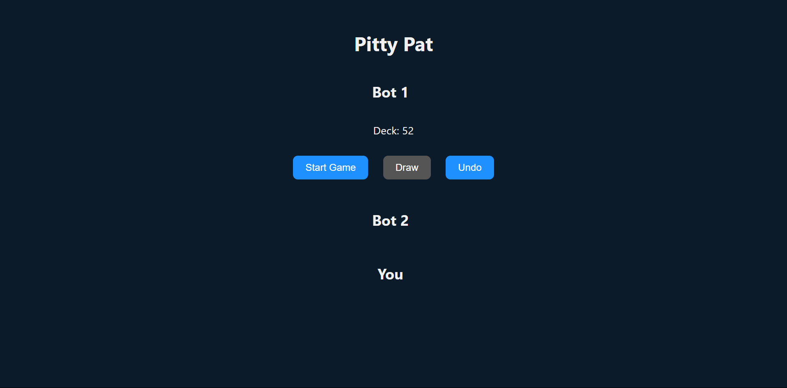
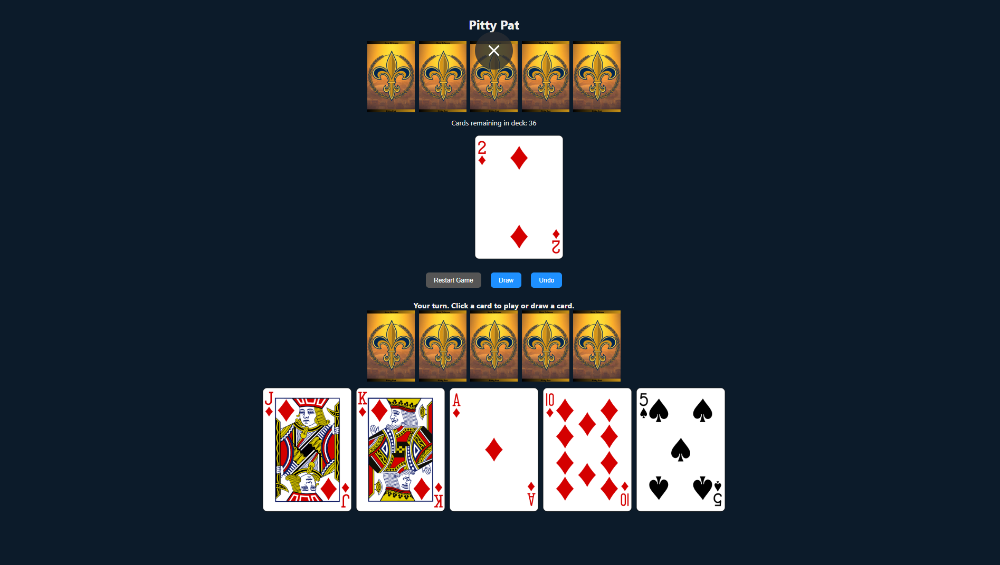

# 🃏 Pitty Pat - A Classic Card Game Reinvented

**Pitty Pat** is a digital version of a beloved card game played in my hometown of  New Orleans for generations. Built using JavaScript, HTML, and CSS, this game is a work in progress focused on recreating the fast-paced, match-based gameplay of the original.

## 💡 About the Game

Pitty Pat is a traditional matching card game, deeply rooted in New Orleans Black culture. It's a staple at every family gathering I've ever attended. The goal? Be the first to discard all five cards from your hand by matching the top of the discard pile.

## 🎯 Objective

- Each player starts with 5 cards.
- Match one card from your hand with the top card on the discard pile.
- The first player to empty their hand wins!

## ✅ Current Features

- 🃏 Renders a shuffled deck using the [Deck of Cards API](https://deckofcardsapi.com/)
- 👥 Basic game setup with two players
- ♠️ Cards visually rendered to screen
- 🎮 Start game functionality

## ⚠️ In Progress

The logic is still under construction. Here's what I'm actively working on:

- 🔄 Matching logic:
  - Ensuring only one card from a set (e.g., 3 of a kind) is playable at a time
- 🛑 Hand management:
  - Enforcing a strict 5-card limit
  - Preventing drawing after initial hand is dealt
- 🏁 Win condition:
  - Recognizing when a player has discarded all cards
  - Special case handling: discarding the last card from a 4-of-a-kind

These rules are subtle but important for an authentic Pitty Pat experience. Rebuilding them in code is a fun challenge I'm currently tackling.

## 🔧 Tech Stack

- JavaScript (Vanilla)
- HTML5
- CSS3
- Deck of Cards API

## 🎓 Lessons So Far

- Designing game logic based on real-world rules
- Working with external APIs
- Dynamic DOM updates for real-time game state
- Learning to break big problems into small, testable parts

## 🖼️ Screenshots

### Game Start Page

### Game Play

## 🛠️ Planned Features

- Single-player mode with basic AI
- Sound effects and animations
- Scorekeeping and round tracking
- Mobile-friendly layout

## 🙋🏽‍♀️ Why This Project Matters

This isn't just a game—it's a cultural artifact. I'm building it as a tribute to the people and traditions that shaped me, and as a way to keep our shared experiences alive through tech.

## 🧠 Want to Help?

Feedback, ideas, or memories of how you played Pitty Pat? Feel free to open an issue or connect with me!

---

*Built with love, laughter, and late-night card games.*
